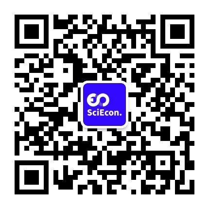

# About Us

## Our Team

    <figure>
        <figurecaption>Prof. Luyao Zhang</figurecaption>
    </figure>
    <figure>
        <figurecaption>Prof. Yulin Liu</figurecaption>
    </figure>
    <figure>
        <figurecaption>Xinyu Tian</figurecaption>
    </figure>
    <figure>
        <figurecaption>Zesen Zhuang</figurecaption>
    </figure>

<!-- Modals -->

  <!-- The Close Button -->

  <!-- Modal Content (The Image) -->
  
  &times;

<!-- Modals -->

  <!-- The Close Button -->

  <!-- Modal Content (The Image) -->
  
  &times;

<!-- Modals -->

  <!-- The Close Button -->

  <!-- Modal Content (The Image) -->
  

<!-- Modals -->
  &times;

  <!-- The Close Button -->

  <!-- Modal Content (The Image) -->
  
  &times;

 

---

**Name**: Luyao Zhang | 张露瑶

**Title**: Founding President (Academia Primary, Industry Secondary)

**LinkedIn**: [https://www.linkedin.com/in/sunshineluyao/](https://www.linkedin.com/in/sunshineluyao/)

**Personal Website**: [http://scholars.duke.edu/person/luyao.zhang](http://scholars.duke.edu/person/luyao.zhang)

**Twitter**: [https://twitter.com/sunshineluyao](https://twitter.com/sunshineluyao)

**Facebook**: [https://www.facebook.com/sunshinestar11](https://www.facebook.com/sunshinestar11)

!!! quote "Motto in light of eastern and western philosophy"
    Dao dejing:The Dao produced One; One produced Two; Two produced Three; Three produced All things.

    道德經: 道生一，一生二，二生三，三生萬物。

    Spinoza: Passion without reason is blind; Reason without passion is dead.

    斯宾诺莎: 天人合一，道法自然

---

**Name**: Yulin Liu | 刘玉林

**Title**: Founding President (Industry Primary, Academia Secondary)

**LinkedIn**: [https://www.linkedin.com/in/yulineth/](https://www.linkedin.com/in/yulineth/)

**Twitter**: [https://twitter.com/YulinLiu20](https://twitter.com/YulinLiu20)

**Personal Website**: [https://www.yulinliu.me/](https://www.yulinliu.me/)

!!! quote "Motto in light of eastern and western philosophy"
    Brightness derives from day’s and night’s deduction.

    日月相推而明生焉

---

**Name**: Xinyu Tian | 田馨宇

**Title**: Interim Chair of Communication

**LinkedIn**: [https://www.linkedin.com/in/xinyu-tian-1777aa203/](https://www.linkedin.com/in/xinyu-tian-1777aa203/)

!!! quote "Motto in light of eastern and western philosophy"
    读万卷书，行万里路。

    Read more, travel more.

---

**Name**: Zesen Zhuang | 庄泽森

**Title**: Interim Chair of Technology Development

**LinkedIn**: [https://www.linkedin.com/in/zesen-zhuang-624591217/](https://www.linkedin.com/in/zesen-zhuang-624591217/)

**Personal Website**: [https://www.crinstaniev.com](https://www.crinstaniev.com)

!!! quote "Motto in light of eastern and western philosophy"
    Preserve your dignity as a nobody; promote the social wellfare as a somebody.

    穷则独善其身，达则兼济天下

## About SciEcon

<figure markdown>
{ width="150" }
</figure>

SciEcon CIC is an NPO registered in the UK. SciEcon exists to:

- Cultivate an integrated talent of researcher, engineer, entrepreneur, investor, philanthropist, and beyond
- Nurture leadership through focusing on interdisciplinary research, the interplay between teaching, research, and practice, and conversation between intellectuals
- Host educational events such as interdisciplinary seminars, symposiums, conferences for a hub of global students, researchers, scholars, practitioners, and beyond

Join our community on multiple platforms to partake in and contribute to intellectual conversation ever since and ever after:

- [x] LinkedIn: <https://www.linkedin.com/company/sciecon-cic>
- [x] Twitter: <https://twitter.com/SciEcon_CIC>
- [x] YouTube: <https://www.youtube.com/channel/UCQOvF-D45s09FlajFkKzoOA>
- [x] Github: <https://github.com/SciEcon>
- [x] Facebook: <https://www.facebook.com/sciecon2022>
- [x] Medium: <https://sciecon.medium.com>
    - [x] SciEcon-Research:　<https://medium.com/sciecon-research>
    - [x] SciEcon-Innovate:　<https://medium.com/sciecon-innovate>
    - [x] SciEcon-AMA: <https://medium.com/sciecon-ama>
- [x] WeChat (ID): SciEcon

<figure markdown>
  { width="300" }
  <figcaption>SciEcon WeChat QR Code</figcaption>
</figure>

- [x] **Subscribe to our news letters** by joining our Google Group: 
<https://groups.google.com/forum/#!forum/sciecon-community/join>