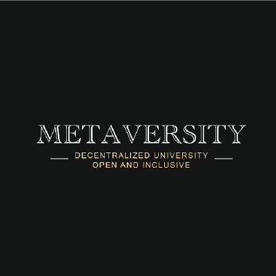
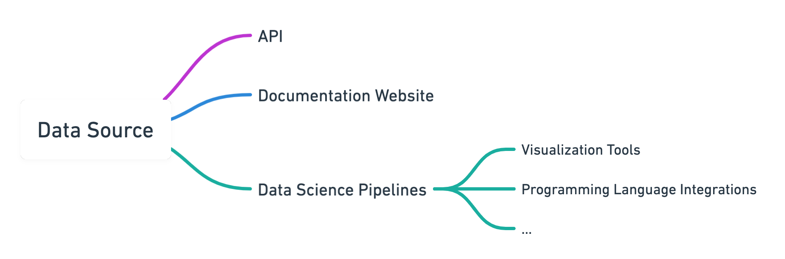

# Metaversity: Data Science Pipeline For Academic Research & Web 3.0 Education

<figure markdown>
  { width=200 }
  <figcaption>Metaversity Logo</figcaption>
</figure>

## Introduction

### Overview of Metaversity

The Metaversity project consists of three phases.

- Phase I: Socrates-Lau Tzu
- Phase II: Plato-Confucius
- Phase III Aristotle-Mencius

This project belongs to the first of the three phases of Metaversity. Metaversity aims to create an integrated, transparent, and open academic research platform on the Internet Computer, providing researchers and educators with reliable sources of data, a platform for behavioral experiments, and an intermediary for sharing educational resources. 

In the first phase, Metaversity will address the need to provide a reliable source of data for research practitioners by creating a research-ready, interpretable on-chain database with a well-documented API and its companion data science pipeline. 

In the second and the third phases, which are planned for the future, we’re going to build a general-purpose on-chain academic platform and integrate it with the database we built in the first phase. In the second phase, we will start with behavioral economics and build an on-chain platform for collecting experimental data and sharing academic resources in behavioral science. We will use the properties of blockchain to address experimental ethics, digital asset copyright, and privacy issues. In the third phase, after successfully building the economics segment, we plan to expand this model to other disciplines; by then, with the help of token economics, governance and NFT, metaversity will become an integrated platform for sharing academic resources, scientific research, and academic certification for a wide range of global scholars.

### Motivation

There exist some blockchain-related data sources, which include token dynamics and allocation, governance related proposals, transaction data, dApp analytics, etc. However, there are common problems with these data sources.

- **Not research-oriented**. Most of the data sources that exist today are not designed with research orientation in mind. They are intended for purely documentary or display purposes or industrial use. This has led to difficulties in the use of blockchain data in academia. One of the biggest obstacles is the lack of uniform standards or guidelines for data access and use, which significantly slows down the efficiency of blockchain-related research iterations. 
- **Lack of integral and reasonable research-wise documentation**. Currently, it’s hard to find data sources with supplementary research-wise documentation. The quality of documentation of blockchain data varies and it is difficult to obtain information from it that is useful for scientific research. One obstacle is that much of the useful information in the blockchain industry, which includes reasonable interpretation of the data sources, is either distributed across the internet or exists in the form of industry common knowledge. This significantly increases the interdisciplinary barriers. Thus, there is a critical need for a consolidated and uniform platform for integrating information and documentation of data sources.
- **Lack of supporting data science pipeline**. Most of the current data sources exist in standalone form. However, related research requires a range of supporting data science tools; for example, easy-to-use and highly compatible database APIs, data monitoring dashboards, integration with several programming languages, etc.

To address these problems, in this phase, we will build an integrated database based on the Internet Computer. This database will be built on a research-oriented base and will contain a detailed data descriptor and documentation for each data source; Moreover, integration packages with common programming languages will be provided, as well as accompanying data science pipeline tools, e.g., data monitoring dashboard.

Due to time constraints, in this project, we will build an example with a few data sources to demonstrate how the platform works, rather than making the complete platform in one go. The data source for this project will be derived from DFINITY’s ICP governance data. 

First, we will query data from several existing ICP data sources. There are currently a few online APIs that provide ICP data, for example, [ICP Public Dashboard API](https://www.google.com/url?q=https://ic-api.internetcomputer.org/&sa=D&source=editors&ust=1656587722268490&usg=AOvVaw10ZGOK6BmepPGOCYnRxlrx) and [ICP Explorer](https://www.google.com/url?q=https://www.icpexplorer.org/%23/&sa=D&source=editors&ust=1656587722268843&usg=AOvVaw276vEoCJ-6VVtUgGKSFlsx). Most of the data in these sources contain only real-time information. However, most academic research requires historical data, so we will first collect and organize these data into the historical form.

Then, we will use the data to build an Internet Computer-based database and provide an academic-friendly API with a detailed data descriptor. And, these APIs will be integrated with common programming languages such as Python.

Finally, we will build a series of data science tools and pipelines to serve these datasets, including a dashboard for real-time data monitoring, and a website for quick referencing the guide the data access and use. 

<figure markdown>
  
  <figcaption>Figure 1: Structure of Each Data Source</figcaption>
</figure>

Figure 1 shows the general structure of each data source that we will present. Each data source will consist of three main parts. 

The first component is the API itself. At this stage, we plan to provide a more traditional RESTful API and place the data on a centralized server first. The format will be similar to the [Public Dashboard API](https://www.google.com/url?q=https://ic-api.internetcomputer.org/api&sa=D&source=editors&ust=1656587722269640&usg=AOvVaw22OINPory19GRapdq0CHr9) provided by the DFINITY Foundation. We first place the data on a centralized server to ensure that we could quickly develop features upfront. In the future, we have plans to gradually move the data to the Internet Computer and build databases through libraries such as [sudograph](https://www.google.com/url?q=https://github.com/sudograph/sudograph&sa=D&source=editors&ust=1656587722269916&usg=AOvVaw2QYYqtKaNzifT-vqiXcxH0).

In the second part, we will provide a detailed documentation site hosted on the Internet Computer for each data source. The presentation and structure of the site should be similar to the online documentation of the [Alpha API](https://www.google.com/url?q=https://www.alphavantage.co/documentation/&sa=D&source=editors&ust=1656587722270318&usg=AOvVaw36j0tuF__oXDJX6RIvBWOU). However, unlike the existing API documentation, for each entry in the API we will provide a more academic description (e.g., the research area to which the data may be applied, the role, relevant research, etc.) and examples of use.

In the third part, we will provide the data science pipeline tools that accompany the dataset. These tools are expected to be designed to be common to all datasets. We will provide visualization tools, for example, like the Internet [Internet Computer Network Status dashboard](https://www.google.com/url?q=https://dashboard.internetcomputer.org/&sa=D&source=editors&ust=1656587722270664&usg=AOvVaw2a3JPThgukFfytl1bZI6X0). At the same time, we will provide integration with popular programming languages to facilitate researchers to quickly put it into use; refer to the [Python wrapper of the Alpha API](https://www.google.com/url?q=https://github.com/RomelTorres/alpha_vantage&sa=D&source=editors&ust=1656587722270918&usg=AOvVaw0GIY3eamWJFAJfw6NZVZ2y) in this part.

## Project Roadmap & Milestones

**Phase I - Milestone I: Data Collection and Database Construction**

Deliverables:

- ICP historical dataset (collected and record from real-time data through DFINITY public API)
- Online Database API (Reference: [DFINITY public dashboard API](https://www.google.com/url?q=https://ic-api.internetcomputer.org/api&sa=D&source=editors&ust=1656587722271723&usg=AOvVaw2ck94Yyon8frK3AGGbwKCO))

**Phase I - Milestone II: API Documentation**

Deliverables:

- API Documentation Site (Reference: [Alpha API](https://www.google.com/url?q=https://www.alphavantage.co/documentation/&sa=D&source=editors&ust=1656587722272356&usg=AOvVaw1PgU-WYEPL5leL_YBu8ooo))

**Phase I - Milestone III: Data Science Tools Development**

Deliverables:

- Programming language wrapper for the API (Reference: [Python wrapper of the Alpha API](https://www.google.com/url?q=https://github.com/RomelTorres/alpha_vantage&sa=D&source=editors&ust=1656587722272992&usg=AOvVaw0V_qp_kS9Ag4bI6wtZTSqL))
- Dashboard (Reference: [Internet Computer Network Status dashboard](https://www.google.com/url?q=https://dashboard.internetcomputer.org/&sa=D&source=editors&ust=1656587722273450&usg=AOvVaw2936zrp13Z2VSOfbPtFOYM))
- Probably more

**Phase I - Milestone IV: Testing**

We will invite researchers in related fields to experience our dataset and use it for logical-wise or user experience-wise optimization.

## To Internet Computer

Metaversity will be the first platform on the Internet Computer to provide academically relevant resources. And Phase I will start with the dataset to add the first type of resource for Metaversity. The Internet Computer has indeed been used with great success in many areas, however, the majority of blockchains are not currently involved in providing services for the academic sector, and neither is the IC. Metaversity will help the Internet Computer take its first steps into the academic space. Through the integration and reproduction of academic resources, Metaversity can increase the exposure of the Internet Computer to the academic field, and attract more talents to engage in relevant research, thereby greatly increasing the speed of expansion of the Internet Computer ecosystem.
