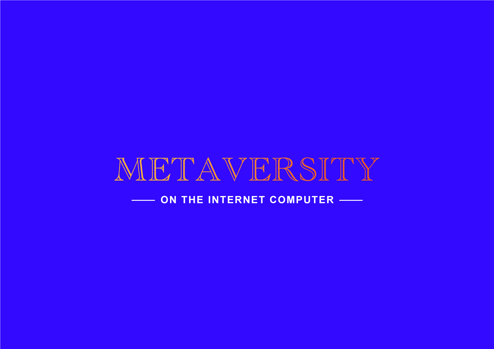

# Metaversity on the Internet Computer: Data Science Pipeline For Academic Research & Web 3.0 Education

<figure markdown>
  { width=200 }
  <figcaption>Metaversity Logo</figcaption>
</figure>

## Introduction

### Overview of Metaversity on the Internet Computer

The Metaversity on the Internet Computer project consists of three phases.

- Phase I: Socrates-Lau Tzu
- Phase II: Plato-Confucius
- Phase III Aristotle-Mencius

This project belongs to the first of the three phases of Metaversity on the Internet Computer. Metaversity on the Internet Computer aims to create an open, innovative, and sustainable academy on the Internet Computer, providing scholars easy access to blockchain data, a platform for generating meaningful behavioral data, and a sustainable ecosystem for the future of academia. In the first phase, Metaversity will address the need to provide a data science pipeline for academic research and web 3.0 education. In the second phase, we plan to build an on-chain platform for behavioral experiments in academia. In the third phase, we plan to create a metaversity of token economy. 

### Motivation

Existing blockchain data source, including token dynamics and allocation, governance related proposals, transaction data, dApp analytics, has three common issues:

- **Not research and education oriented**. Most of the data sources that exist today are not research and education oriented, but intended for purely documentary, display purposes, or industrial usage, which has caused unnecessary barriers to using blockchain data in academia. One of the biggest obstacles is the lack of uniform standards or guidelines for data access and usage, which significantly slows down the efficiency of blockchain-related research iterations. 
- **Lack of integral and reasonable research-wise documentation**. Currently, it’s hard to find data sources with supplementary research-wise documentation. The quality of documentation of blockchain data varies, and it is difficult to get information from it that is useful for scientific research. One obstacle is that much of the useful information in the blockchain industry, which includes a reasonable interpretation of the data sources are not understandable for the interdisciplinary audiences. Thus, there is a critical need for an integrated platform to enable an inclusive ecosystem of researchers and educators from multiple disciplines.
- **Lack of supporting data science pipeline**. Most of the current data sources exist in standalone form. However, related research requires a range of supporting data science tools; for example, easy-to-use and highly compatible database APIs, data monitoring dashboards, integration with several programming languages, etc.

### Phase I solutions

We will build a data science pipeline intended for academia usage including database, API, detailed documentations, common programming language integration solutions, and data monitoring dashboards for research and educational purpose. Furthermore, we will invite scholars to join academic projects using our data science pipeline, together create sample deliverables, and conduct user-experience studies to further improve our product. 
 

First, we will query data from several existing ICP data sources. There are currently a few online APIs that provide ICP data, for example, [ICP Public Dashboard API](https://www.google.com/url?q=https://ic-api.internetcomputer.org/&sa=D&source=editors&ust=1656587722268490&usg=AOvVaw10ZGOK6BmepPGOCYnRxlrx) and [ICP Explorer](https://www.google.com/url?q=https://www.icpexplorer.org/%23/&sa=D&source=editors&ust=1656587722268843&usg=AOvVaw276vEoCJ-6VVtUgGKSFlsx). Most of the data in these sources contain only real-time information. However, most academic research requires historical data. Hence, we will identify the data of academic value and collect the historical data. 

Then, we will use the data to build a database and provide an academic-friendly API. We plan to provide a conventional RESTful API. The format will be similar to the [Public Dashboard API](https://ic-api.internetcomputer.org/api) provided by the DFINITY Foundation. We first place the data on a centralized server to ensure that we could quickly develop features upfront. In the future, we plan to migrate the database to the Internet Computer and build databases through libraries such as [sudograph](https://github.com/sudograph/sudograph). Furthermore, we will provide API integration solutions for common programming languages such as Python similar to the [Python wrapper of the Alpha API](https://github.com/RomelTorres/alpha_vantage). 

Finally, we will build a series of data science accessories to serve the database usage, including a dashboard for data monitoring and detailed data descriptors. We will provide visualization tools similar to the [Internet Computer Network Status dashboard](https://dashboard.internetcomputer.org/). Our data descriptors will be similar to the online documentation of the [Alpha API](https://www.alphavantage.co/documentation/) in presentation, but providing more guidance in academic usage. 

<figure markdown>
  
  <figcaption>Figure 1: Product Structure of Each Data Source</figcaption>
</figure>

## Project Roadmap & Milestones

**Phase I - Milestone I: Data Collection and Database Construction**

Deliverables:

- Create ICP Historical Database
>collect and record by constantly querying real-time data through DFINITY public API
- Create Online Database API 
>Reference: [DFINITY public dashboard API](https://www.google.com/url?q=https://ic-api.internetcomputer.org/api&sa=D&source=editors&ust=1656587722271723&usg=AOvVaw2ck94Yyon8frK3AGGbwKCO)

**Phase I - Milestone II: API Documentation**

Deliverables:

- Create API Documentation Site 
>Reference: [Alpha API](https://www.google.com/url?q=https://www.alphavantage.co/documentation/&sa=D&source=editors&ust=1656587722272356&usg=AOvVaw1PgU-WYEPL5leL_YBu8ooo)

**Phase I - Milestone III: Data Science Tools Development**

Deliverables:

- Create Programming language wrapper for the API 
>Reference: [Python wrapper of the Alpha API](https://www.google.com/url?q=https://github.com/RomelTorres/alpha_vantage&sa=D&source=editors&ust=1656587722272992&usg=AOvVaw0V_qp_kS9Ag4bI6wtZTSqL)
- Create Interactive Dashboard for Researchers and Educators 
>Reference: [Internet Computer Network Status dashboard](https://www.google.com/url?q=https://dashboard.internetcomputer.org/&sa=D&source=editors&ust=1656587722273450&usg=AOvVaw2936zrp13Z2VSOfbPtFOYM)

**Phase I - Milestone IV: User Experience Study for Improvements**

- Invite professors and students in multiple disciplines to joint research and educational programs using our data science pipeline
- Conduct user-experience studies to collect feedback for further improving our data science pipeline

## To Internet Computer

Metaversity will be the first platform intended for serving an academic purpose on the Internet Computer. Our project will attract global professors and students to innovate on the Internet Computer for the great cause of research and education. Blockchain has empowered an open internet for many industrial sectors, but the application for academia still awaits. Our project will enable IC to take the first essential step into the academic space, attracting intellectuals able to innovate at the frontier of human civilizations. 

